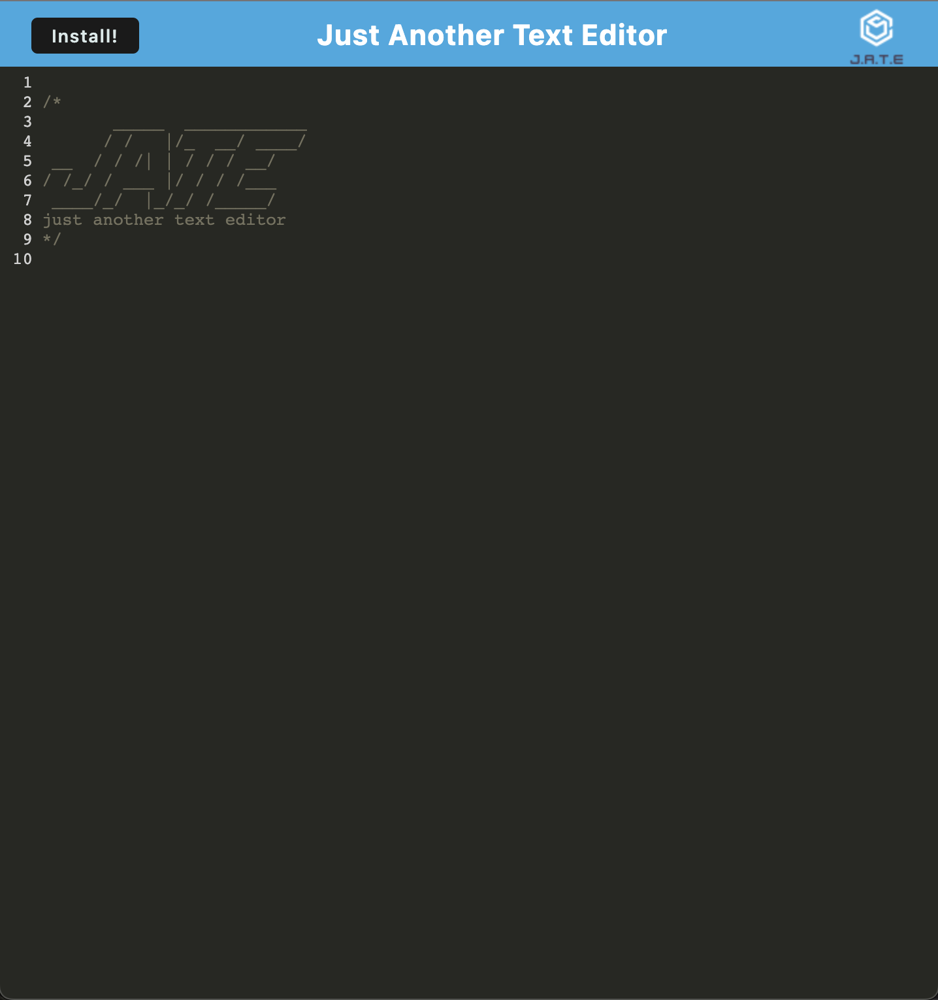
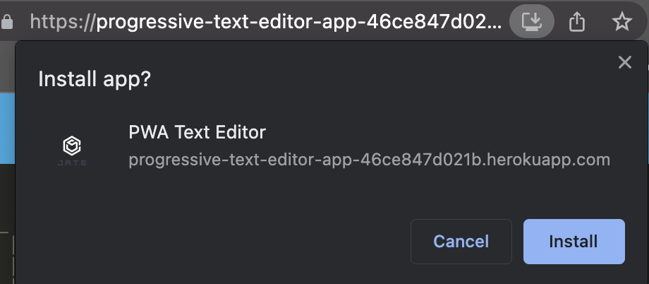

# Text Editor (PWA)

Progressive Text Editor Web Application.

Create and manage notes or code snippets with or without an internet connection.

Data can be retireved for later use.

Deployed: https://progressive-text-editor-app-46ce847d021b.herokuapp.com/

---
## Table of Contents

1. [Usage](##-usage)
2. [Development](##-development)
3. [Contribution Guidelines](##-contribution-guidelines)
4. [Dependancies](##-dependancies)
5. [License](##-license)
6. [Questions](##-questions)
---

---

## Usage

Input notes or code snippits.

Use the Install button to save.

Run this application offline by installing it through the browser.

---

## Development

Install Dependancies:
>npm install

Start Application in Development Mode:
>npm run start:dev

---

## Contributing Guidelines

Contributions are welcome upon request.

---

## Dependancies

Express & Webpack.

---

## License

This application is covered under the MIT License.

---

## Questions?

Github: @dylansth

Email: dylan.ericsthilaire@gmail.com